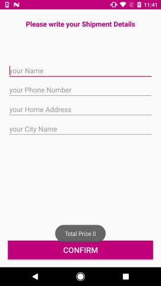
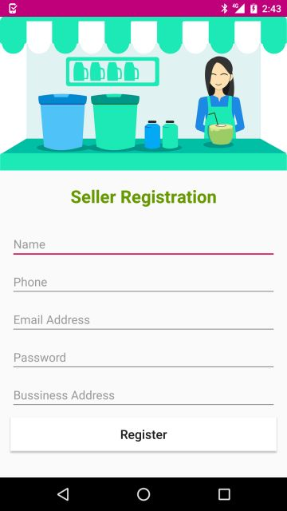
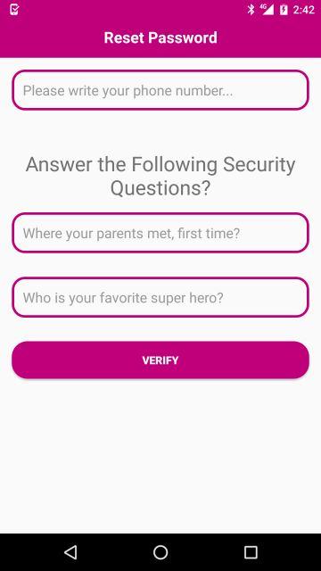
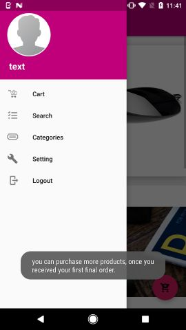

# eCommerce
A project which allows user to login and register and done using Firebase and the database is also saved in the Firebase. Fast and responsive app.

The Features of This Application is :

1. User Registration and login.
2. Admin login and registration.
3. Seller login and registration.
4. Single Activity Model with reusable Fragments.
5. Show Product Details.
6. Add any product to cart and update total item count and amount.

  
 
 
 
 
